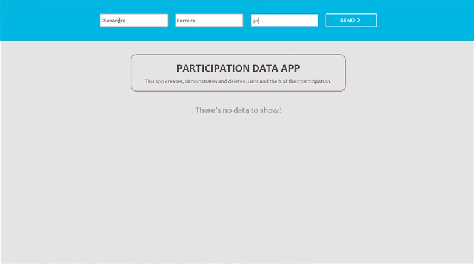
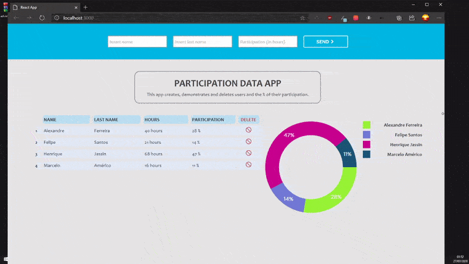

Pinning it now as its been few years since the interview.
I was given less than a day to finish the following steps, I have never used Docker at this point and my react skills were very limited, had to pick it up quickly, build backend, frontend and a docker to contain it all.
I did end up getting an offer from them, I had 2 other offers at this point so i ended up chosing another company.


# Safekeep Fullstack Challenge

## About this project
Seems like you're trying out for a position at Safekeep or you've found this and would like to apply. Fork this repo and give it a go. ;)

Your goal is to create a simple CRD application.

The GIF below will show you what needs to be done. The input fields will be a person's name, surname and hours of participation - calculate the participation percentage afterwards. Create a table and pie chart for us to visualize the data. You can use any library for the visualizations/charting, we suggest react-charts or react-apex-charts. Styling is up to you - the prettier it is the more brownie points you get from us :'). <b> Your project doesn't need to look identical to the GIF below.</b>  However, the design should be responsive for mobile and web applications (see the GIF). Also, please write <b>1 unit test of your choice using Jest.</b>

## Technology stack
>❗ Please use [ExpressJS](https://expressjs.com/), [Yarn](https://yarnpkg.com/), [JestJS](https://jestjs.io/), and [ReactJS](https://reactjs.org/) and the included [docker-compose](https://docs.docker.com/compose/) will spin up a local instance of [PostgreSQL](https://www.postgresql.org/) (if you have it already installed on your local please stop it). Use Express to create an API server connecting to the docker-compose postgres.

## Project Structure
Create two directories called backend/ and frontend/. 

## Runtime Instructions
Run the provide docker-compose to spin up a PostgreSQL container.
```shell
docker-compose up
```

Make the run commands for the ExpressJS server
```shell
node app.js
```

Make the run commands for the React App
```shell
yarn start
```

### Demo



